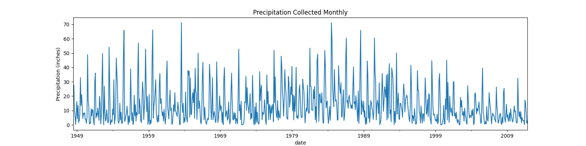
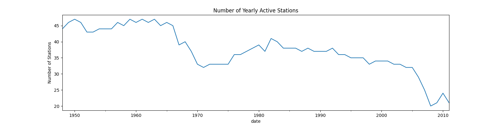
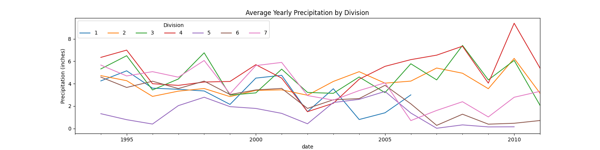

# Hourly Precipitation Data Tool

A cli tool to help parse and analyze NCDC Hourly Precipitation Data (HPD).

Data is downloaded from NCDC's
[FTP server](ftp://ftp.ncdc.noaa.gov/pub/data/hourly_precip-3240)
The [data specification](ftp://ftp.ncdc.noaa.gov/pub/data/hourly_precip-3240/dsi3240.pdf)
is also located FTP server.


## Installation

```
git clone git@github.com:dankolbman/ncdc-hpd.git
cd ncdc-hpd
pip install -e .
```

## Use

Use the `python precip` command. A helpful docstring should be displayed:

```
python precip -h
usage: precip [-h] [--states [...]] [-v] {download,transform,analyze}

HPD Tool to download. transform, and analyze an HPD dataset.

positional arguments:
  {download,transform,analyze}

optional arguments:
  -h, --help            show this help message and exit
  --states [ ...]       The state to perform the action for. Any valid, two letter, uppercase state code may be used
  -v, --verbose         Whether to show debug messages or not

```

## Run Tests

Pytest is the suggested test runner. Tests are contained in the `tests/`
directory.

```
pip install pytest
pytest tests
```

## Case Study: Arizona

### Downloading Data

We can use the tool to first download all historical data for Arizona (AZ):

```
python precip download --states AZ
INFO:precip.etl:Downloading data for US state 'AZ'
INFO:precip.download:Downloaded 13 data files for 'AZ'
INFO:precip.etl:Extracting data for US state 'AZ'
INFO:precip.etl:Combining data for US state 'AZ'
INFO:precip.download:Combined all data for US state 'AZ' to  data/02/combined.txt
```

This will:
1) Download the data into the data directory
2) Extract the data into an extracted directory
3) combine all extracted files into one file

### Transforming Data

Before data can be analyzed, we will want to clean it up by adding some easier
to use flags.
We can do this with the `transform` command:

```
python precip transform --states AZ
INFO:precip.etl:Transforming combined raw data into more managble format
INFO:precip.etl:Saving transformed data to data/02/transformed.csv
```

This will do things like explicitly mark records that were deleted as such.

### Analyze

Lastly, we will want to run analysis on the transformed data:
```
python precip analyze --states AZ
INFO:precip.etl:Total precipitation collected from all stations from 1948 to 2011: 10313.39 inches
INFO:precip.etl:That's an average of 163.70 inches collected per year
INFO:precip.etl:Saved figures to data/02/analysis
```








## Design of a Production Service

The client format of this tool doesn't make much sense if it were to be
deployed in the real world. A more realistic architecture may look like an
ETL pipeline that is responsible for downloading, combining, and formatting
the data then loading it to tables in a warehouse. From here we can more easily
and collaboratively answer questions about the data.


## Unmatched Brackets

Documentation says that unmatched brackets are rare, but overall there are:
28 stations with unmatched deletion brackets
71 stations with unmatched missing data brackets

There is nothing about how to resolve the issue of missing brackets, so any
bracket that does not appear to have a matching start or end bracket is
interpreted as itself being deleted only.
It's important to note also that the bracket matching is only attempted per
station as it's assumed that each station provides its own stream. It should
not be possible for missing brackets in one station to be coincedentally
terminated by another station.

Further investigation shows that many stations have repeat starts of missing
data brackets that are unterminated. This seems to indicate that these flags
are unreliable so they are simply ignored for analysis.
