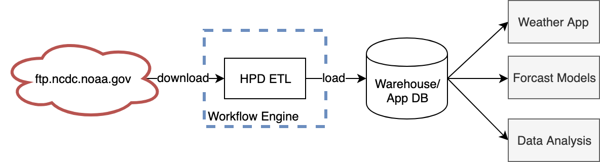

# Hourly Precipitation Data Tool

A cli tool to help parse and analyze NCDC Hourly Precipitation Data (HPD).

Data is downloaded from NCDC's
[FTP server](ftp://ftp.ncdc.noaa.gov/pub/data/hourly_precip-3240)
The [data specification](ftp://ftp.ncdc.noaa.gov/pub/data/hourly_precip-3240/dsi3240.pdf)
is also located FTP server.


## Installation

```
git clone git@github.com:dankolbman/ncdc-hpd.git
cd ncdc-hpd
pip install -e .
```

## Use

Use the `python precip` command. A helpful docstring should be displayed:

```
python precip -h
usage: precip [-h] [--states [...]] [-v] {download,transform,analyze}

HPD Tool to download. transform, and analyze an HPD dataset.

positional arguments:
  {download,transform,analyze}

optional arguments:
  -h, --help            show this help message and exit
  --states [ ...]       The state to perform the action for. Any valid, two letter, uppercase state code may be used
  -v, --verbose         Whether to show debug messages or not

```

## Run Tests

Pytest is the suggested test runner. Tests are contained in the `tests/`
directory.

```
pip install pytest
pytest tests
```

## Case Study: Arizona

### Downloading Data

We can use the tool to first download all historical data for Arizona (AZ):

```
python precip download --states AZ
INFO:precip.etl:Downloading data for US state 'AZ'
INFO:precip.download:Downloaded 13 data files for 'AZ'
INFO:precip.etl:Extracting data for US state 'AZ'
INFO:precip.etl:Combining data for US state 'AZ'
INFO:precip.download:Combined all data for US state 'AZ' to  data/02/combined.txt
```

This will:
1) Download the data into the data directory
2) Extract the data into an extracted directory
3) combine all extracted files into one file

### Transforming Data

Before data can be analyzed, we will want to clean it up by adding some easier
to use flags.
We can do this with the `transform` command:

```
python precip transform --states AZ
INFO:precip.etl:Transforming combined raw data into more managble format
INFO:precip.etl:Saving transformed data to data/02/transformed.csv
```

This will do things like explicitly mark records that were deleted as such.

### Analyze

Lastly, we will want to run analysis on the transformed data:
```
python precip analyze --states AZ
INFO:precip.etl:Total precipitation collected from all stations from 1948 to 2011: 10313.39 inches
INFO:precip.etl:That's an average of 163.70 inches collected per year
INFO:precip.etl:Saved figures to data/02/analysis
```
The analysis directory will also contain the following images:


### Discussion of Results

Let's review the results obtained from the tool in the above.

> #### Nitpick on Problem Statement
>
> The initial question proposed was `calculate the total rain fall for Arizona 
> [over all historical data]`.
> However, it should be noted that this data measures the _precipitation_ and
> not rainfall alone. The difference between rainfall and precipitation is not
> clearly made in the data (aside from perhaps some hint with the `Z` flag).
> Thus, we cannot deduce the amount of precipitation from _rainfall_ vs other
> precipitation methods like snow (yes it snows in Arizona!).

Firstly, it must be noted that the _total rainfall_ in the problem statement
is interpreted to mean the _total collected precipitation_.
The HPD-3240 dataset includes many rain guages which may occupy similar
regions. This means that the sum of all measurements is highly dependent
on the number of samples being taken, rather than the pure rainfall quantity.

That being said, the numbers come out as such:
```
Total precipitation collected from all stations from 1948 to 2011: 10313.39 inches
That's an average of 163.70 inches collected per year
```

This doesn't mean much by itself, the other bits of analysis tell us more.


Again, this is the total _collected_ precipitation that occurs, by month.
This graph tells us more about our sampling power than anything actual
accumulation.


This shows how many stations are operating each year. Any station that reports
one or more records is considered as active.
Here we see that the number of active stations falls toward 2011 when NOAA
presumably started shifting to its new network.
It also tells us that the averages we get here will not be as good of a
sampling as in prior years.


This graph shows the average precipitation by Division.
It has been normalized by number of active stations per year and so shows
how the average precipitation varies by geographic region.
Its worth noting that some of these divisions have one or even no stations
active for some years, so the accuracy may be suspect.

See the National Weather Service's page on
[Climate Divisions](https://www.ncdc.noaa.gov/monitoring-references/maps/us-climate-divisions.php#history)
for more on how the US is divided.

We can compare these numbers with those found on 
[CoCoRaHS](https://www.cocorahs.org/WaterYearSummary/State.aspx?state=AZ&year=2010)
for 2010.
Comparing indicates that the results match the right order of magnitude,
although may first appear low side of average.
However, it must be noted that even CoCoRaHS reports relatively high variance
within the same regions and we are not sure of the exact positioning of our
rain gauges, so the comparison would seem to validate our analysis.


## Design of a Production Service

The CLI format of this tool doesn't make sense for real-world use.
It's likely that we would be dealing with one of the following scenarios if
we were to need the HPD dataset in reality:
1) We want to ingest HPD to augment our weather history service
2) We want to provide HPD to our data team to use in their analysis or models 

The first case is oriented around an OLTP workflow where we would likely
just want to parse HPD and load it into whatever relational model our service
is running. 

The second case is more likely. We would want to expose HPD to our data
team so they can run analysis or build models on it in conjunction with other
data we may be in possesion of.
In this scenario, we would likely want to load HPD into a data warehouse or
other destination where the focus is on OLAP workloads.

Regardless of the use case, our solution would probably look like this:



Where our ETL code is managed by a workflow engine (Airflow, Jenkins, etc)
and will be run on demand or some schedule.
Our ETL will then only have the responsibility of populating tables within our
persistence layer with the HPD data and keeping it up to date.
Use of a workflow engine will also encourage design patterns around how the
code is written to populate these tables as well as provide some audit and
monitoring system around it.

The analysis or other consumption of the data will then be done through the
persistance layer (SQL or otherwise). This maximizes the possible number of
consumers of the data (data people would rather SQL interface than python cli)
to ensure it has maximum usability and impact.

## Unmatched Brackets

Documentation says that unmatched brackets are rare, but overall there are:
28 stations with unmatched deletion brackets
71 stations with unmatched missing data brackets

There is nothing about how to resolve the issue of missing brackets, so any
bracket that does not appear to have a matching start or end bracket is
interpreted as itself being deleted only.
It's important to note also that the bracket matching is only attempted per
station as it's assumed that each station provides its own stream. It should
not be possible for missing brackets in one station to be coincedentally
terminated by another station.

Further investigation shows that many stations have repeat starts of missing
data brackets that are unterminated. This seems to indicate that these flags
are unreliable so they are simply ignored for analysis.
